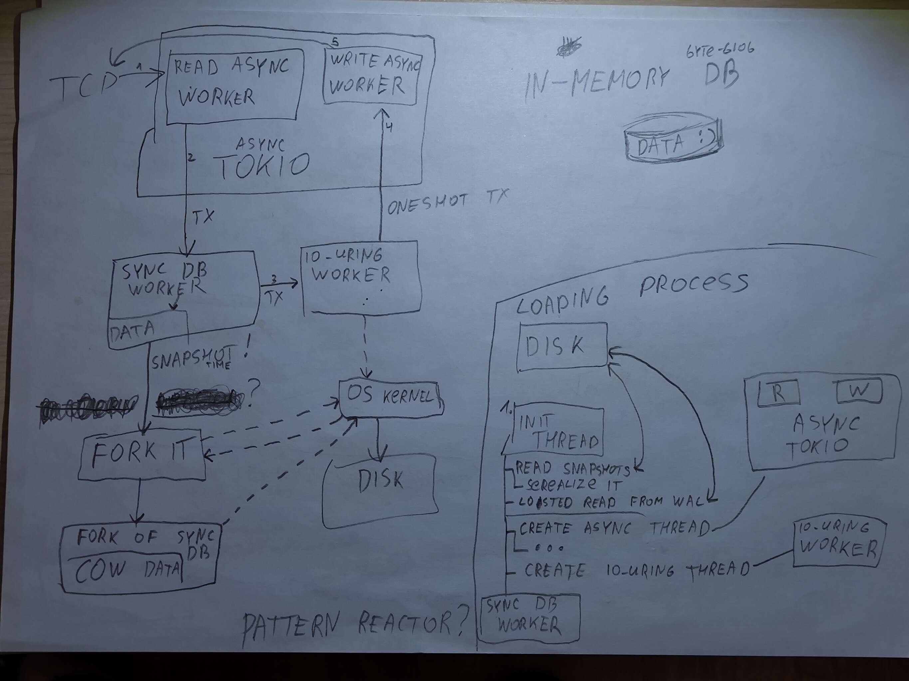
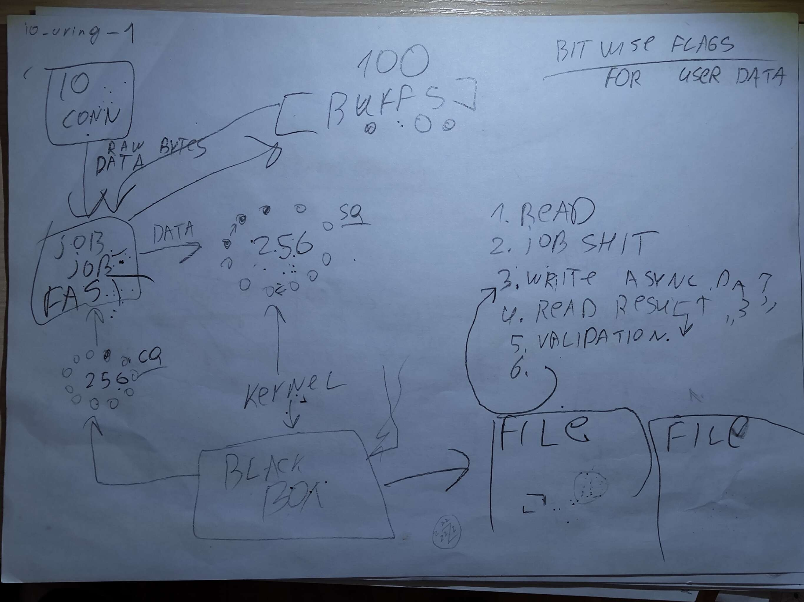
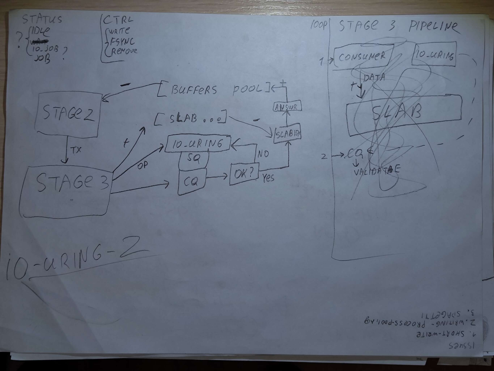

<div align="center">

</div>

# Pipelined in-memory KV database (WIP)

My attempt at building an in-memory database engine from scratch. Heavily inspired by Tarantool's architecture (single-threaded transaction processing, WAL design) plus some ideas from SEDA and LMAX Disruptor papers, and DDIA as the starting point.

**To be clear: this is a learning project and a foundation for something bigger, not a finished product. The goal is to understand how storage engines actually work by building one, not to replace Redis. That said, it is already stupidly fast (see numbers below).**

## The idea

The usual problem with "multi-threaded Redis clones" is either mutex contention or thread synchronization overhead. So instead of sharding or locking the map, everything runs through a 3-stage pipeline (this is where the Tarantool influence is most visible):

```
[tokio network threads] -> (mpsc) -> [single sync db thread] -> (mpsc) -> [io_uring wal writer]
```

<details>
<summary>See the core architecture sketch</summary>


</details>


1. **Stage 1 (network IO)**: tokio tasks accept TCP sockets and parse the length-prefixed binary protocol into `Request` structs.
2. **Stage 2 (execution engine)**: one dedicated blocking thread owns the `HashMap`. Since only one thread ever touches it, there are zero mutexes and zero RwLocks.
3. **Stage 3 (disk IO)**: io_uring thread encodes WAL redo records, writes segment batches and does group commit fsync. Encoding lives here on purpose: profiling showed stage 2 is the hot thread while the I/O thread idles, so the WAL buffer construction was offloaded out of the core.

On top of that there is a zero-alloc buffer ring: 32 preallocated `Batch` buffers circulate `free pool -> stage 2 -> stage 3 -> back`. Vectors get `.clear()`-ed instead of dropped, so capacity survives. I wrote a custom `GlobalAlloc` wrapper to verify this: under steady load, allocations per second drop to basically zero.

<details>
<summary>See the io_uring queues and memory slab sketch</summary>



</details>

## Numbers

6M+ ops/sec in `nofsync` mode (50/50 GET/PUT, 64-byte values, pipeline depth 64) on my laptop (AMD Ryzen 7 H 255, 16 threads @ 4.97 GHz). In `sync` mode (real `fdatasync` before replying, with group commit) it holds ~600k ops/sec. That's consumer hardware, not a tuned server box. A proper benchmark comparison vs Redis/Dragonfly is on the list, but for now I'm pretty happy with this :)
```sh
elapsed         10.01 s
total ops       65698304
throughput      6566091 ops/sec
net throughput  313.1 MiB/sec
```

## Durability modes

Pass as a CLI arg:

- `nofsync` (default): writes go to the OS page cache, no fsync. Survives `kill -9`, loses data on power cut. Same idea as Tarantool's `wal_mode=write`.
- `sync`: real `fdatasync` after every batch, reply only after disk commit. Survives power cut, slow.
- `async`: reply right after stage 2 (memory), WAL write/fsync happens in background. Fast, tiny data loss window on crash.

## Status / roadmap

- [x] 3-stage pipeline (tokio -> sync core -> io_uring)
- [x] WAL with group commit, 3 durability modes
- [x] Zero-alloc buffer ring
- [x] Async WAL refactor
- [x] Restart recovery
- [ ] Non-blocking snapshots (right now `write_snapshot()` blocks stage 2, need fork COW or a shadow snapshotter)
- [ ] Small plugin system
- [ ] Lua scripting on top of the plugin system (Tarantool vibes again, yes)
- [ ] Proper benches vs Redis / Dragonfly

## Architecture Sketches

If you are interested in the raw design process and how this database evolved from an idea to actual `io_uring` structures, check out the [`schemes/`](schemes/) directory. 

It contains all the original hand-drawn blueprints.

## Quickstart

```bash
# run server on port 9000
cargo run --release --bin server -- 9000 nofsync ./data

# run load bench (16 conns, 64 pipeline depth, 10 secs)
cargo bench -p server -- 127.0.0.1:9000 16 64 10 50 64
```

## Wire protocol

Dead simple length-prefixed binary format, little endian:

```
request:  [len: u32][op: u8][klen: u32][key bytes][val bytes]   (op: 0 = GET, 1 = PUT)
response: [len: u32][status: u8][val bytes if GET]              (status: 0 = VALUE, 1 = OK, 2 = MISS, 3 = UNKNOWN_OP)
```
